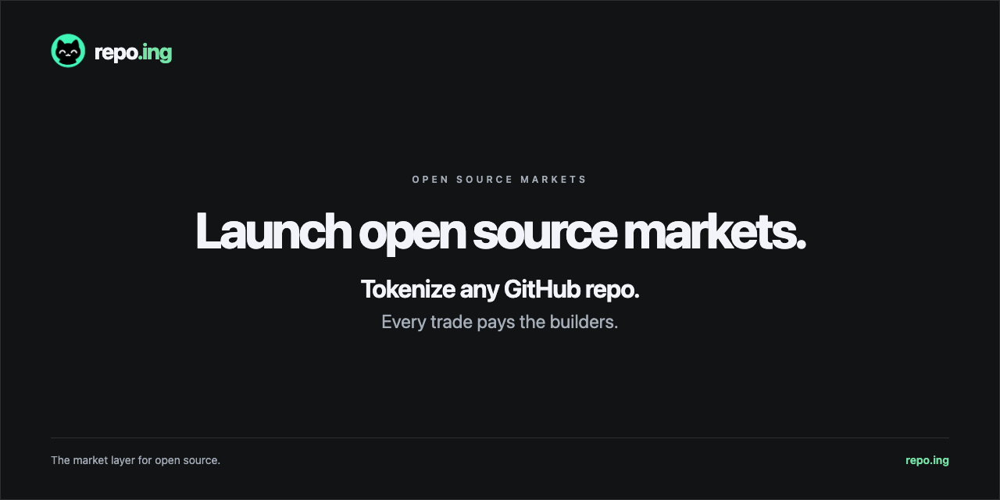
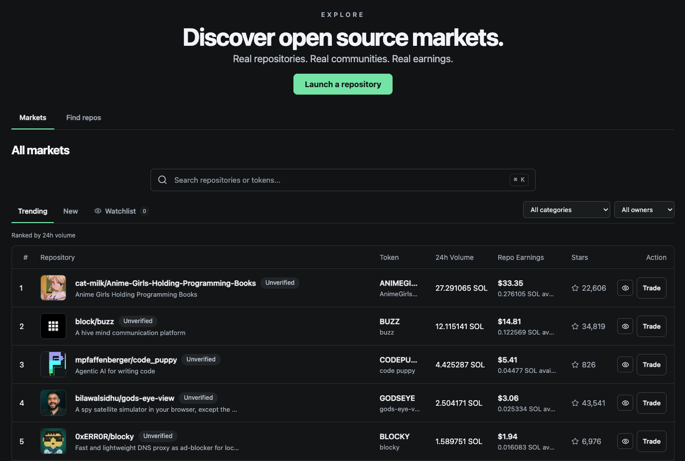
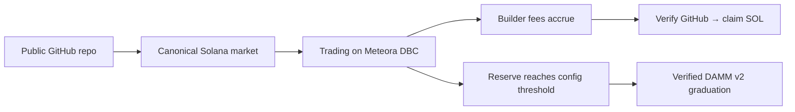
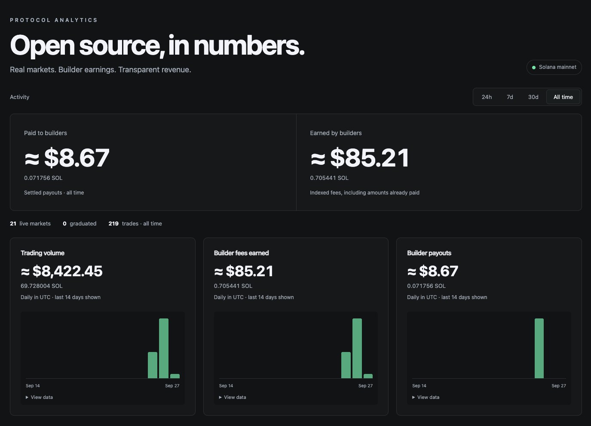

<p align="center">
  <a href="https://repo.ing"></a>
</p>

<p align="center">
  <a href="https://repo.ing/explore"><strong>Explore markets</strong></a> ·
  <a href="https://repo.ing/launch">Launch a repo</a> ·
  <a href="https://repo.ing/stats">Protocol analytics</a> ·
  <a href="docs/README.md">Documentation</a>
</p>

# The market layer for open source.

[](https://repo.ing/token/59PXVfJ28HLYpdYLz8rt8ziE9EWbK4mS8xvq38NUQ1Be)

**repo.ing connects public GitHub repositories to canonical token markets on Solana.** Anyone can discover an eligible repository and launch its market. Trading earns fees for its builders, even before they connect. A current repository administrator can verify with GitHub, bind a payout wallet, and claim those earnings.

One repository. One market. Identity follows GitHub's permanent numeric repository ID, so a rename or transfer does not create a duplicate.

> A community launch does not imply maintainer endorsement. A repository token gives no ownership of the code, repository, brand, or business.

## Three ways to participate

| You are a… | Start here | What happens |
| --- | --- | --- |
| **Discoverer** | [Find repos](https://repo.ing/find-repos) → review → launch | Find a project getting attention, create its market, and earn a limited share of eligible partner fees. |
| **Trader** | [Explore](https://repo.ing/explore) → choose a market | Review balances, quotes, price impact, and minimum received before signing. Track graduation and transaction receipts. |
| **Builder** | [Builders](https://repo.ing/builders) → verify GitHub | Prove current admin access, set a payout wallet, and claim fees across your repositories. |

These can be different people. Launching a market does not give its launcher the builder's entitlement.

<a href="https://repo.ing/explore"></a>

*Production interface, September 26, 2026. Screenshots are snapshots; use the live pages for current figures.*

## From a repository to a market



### Launch

Paste an eligible public GitHub URL, review its identity, name, ticker, and project image, then approve in your wallet. The launch defaults to **No buy**. An optional initial purchase is capped at **3% of token supply**, with 1%, 2%, and Max 3% presets. This cap applies to the launch transaction, not all future purchases by that wallet.

Phantom, Backpack, MetaMask's Solana connection, and compatible Solana Wallet Standard wallets are supported. Availability depends on the wallet, browser, and required signing features. repo.ing never asks for a seed phrase.

[Agent launch reviews and README shortcuts](https://repo.ing/agents) use the same launcher: an agent can find a repo and produce a review link, while the user reviews artwork and costs and approves with their wallet. Agents receive no signing authority. [MCP setup and tools →](docs/AGENT_LAUNCH.md)

### Trade and graduate

New markets use an **85 SOL real quote-reserve threshold** and begin on Meteora Dynamic Bonding Curve. Buys build reserve; sells can reduce it. **Volume is turnover, not reserve.** Virtual pricing reserves are not deposited SOL.

After the threshold is met and migration is verified, the market continues in Meteora DAMM v2. The migrated liquidity is split **50% creator / 50% partner**, with both positions permanently locked. Their fees remain claimable. Graduated trading opens the verified Meteora pool.

Older markets keep their original configs. [Liquidity guide →](docs/LIQUIDITY.md)

### Builders earn fees and an allocation

Before graduation, the **1.75% total DBC trading fee** has these nominal shares:

| Recipient | Share of fee-paying trade value |
| --- | ---: |
| Repository builders | **0.994%** |
| repo.ing partner | **0.406%** |
| Meteora protocol | **0.350%** |

Settlement uses exact integer fee events, including rounding. After graduation, fees follow the DAMM pool and position rules; the fixed DBC percentages do not carry over unchanged.

**New enrolled markets also reserve 1% of their fixed 1 billion supply — 10 million tokens — for the verified builder.** This is a one-time allocation from existing supply, claimable only after verified graduation. It is active for the current launch config; historical markets are not retroactively enrolled. Builder trading fees continue separately.

GitHub verification requires current **admin** access. The App requests **Metadata: read**, not code-write permission. A wallet-binding message proves control of the payout wallet. The Builders dashboard supports setting a wallet across repositories and claiming all ready fees with individual results and receipts. [Builder guide →](docs/USER_GUIDE.md#claim-builder-fees)

### Discoverers earn a limited reward

The original launch wallet earns **50% of actual eligible partner DBC fees** for enrolled markets. This comes from the partner share; it adds no extra trading fee and does not reduce the builder share.

Accrual ends at the earliest of:

- curve completion;
- 30 days from on-chain activation;
- the market's stored lifetime cap: **2.5 SOL for new v2 launches**, **1 SOL for earlier v1 launches**.

Already-earned rewards remain claimable afterward. Paid rewards count toward the cap. [Reward rules and settlement proof →](docs/DISCOVERY_REWARDS.md)

## $REPOING and platform revenue

The active V1 policy allocates eligible **claimed platform revenue** as follows:

| Allocation | Share | Current meaning |
| --- | ---: | --- |
| **$REPOING buyback reserve** | **60%** | Bought back manually by the team from the published buyback wallet; the in-app buyback executor is off. |
| **Protocol liquidity** | **20%** | Added manually by the team to the canonical $REPOING pool; the in-app liquidity executor is off. |
| **Treasury** | **20%** | Retained platform allocation for operations. |

The allocation path consumes **settled platform-fee claims**: DBC collections reserve unpaid discovery rewards before payment; DAMM claims use the platform partner position. Builder earnings and discoverer obligations are separate. See [fee collection and treasury custody](docs/DBC_PLATFORM_COLLECTION.md). An accrued fee is not spendable revenue, and an allocation is not an executed purchase.

**$REPOING is live through the ordinary repository launch path.** This repository was tokenized with the same 1 billion supply, 1% builder allocation and normal discovery/fee rules as other new markets. Its immutable on-chain ticker is **REPOING**; earlier planning used `$REPO`. The launch/team wallet purchased approximately **3%** for **0.856011397 SOL**, excluding launch account/network costs. The normal 1% builder allocation is separate and unlocks after verified graduation. Builder earnings remain separate from the 60/20/20 policy; eligible partner-fee claims enter that policy like other markets. [Verified mint, launch receipt, and wallet disclosure →](docs/REPO_IDENTITY.md)

**Current operations:** the in-app buyback and liquidity executors are not enabled. The team runs the policy manually from published wallets: a platform-fee sweep claims fees to the partner fee wallet, allocates 60/20/20, and moves the buyback share still owed to the custody buyback wallet; buybacks are swapped from that wallet (platform revenue) and from the team wallet (team buybacks on top of the policy); liquidity is added by the team wallet to the canonical $REPOING DAMM v2 pool. A worker detects and publishes buyback receipts from those wallets. There is no automated buying or promised return. Every $REPOING buyback made so far (platform revenue and team wallet) is published with its on-chain receipt and running total on [Stats](https://repo.ing/stats); Stats also shows where buybacks stand against the policy (SOL ahead or due) and the published liquidity deposits. The [first audit](docs/BUYBACK_AUDIT_2026_09_28.md) covers the initial two purchases. Recorded revenue allocations remain separate from the purchase total and are not proof of a live funded wallet balance. [Full $REPOING readiness and policy →](docs/REPO_TOKEN.md) · [Ordinary launch economics and review →](docs/REPO_SELF_LAUNCH_REVIEW.md)

## Transparent protocol analytics

[Stats](https://repo.ing/stats) shows builder earnings, settled payouts, trading volume, UTC activity charts, and reconciled platform reserves. Choose **24h**, **7d**, **30d**, or **All time**, inspect exact SOL values, and open payout receipts.

<a href="https://repo.ing/stats"></a>

USD figures use the current SOL price; they are estimates, not historical dollar proceeds. Empty periods stay empty. Pending payouts and unverified pools are excluded. [Metric definitions →](docs/ANALYTICS.md)

## What is live, and what is gated

| Area | State |
| --- | --- |
| Launches, DBC trades, builder claims, discovery rewards | **Live**, with recorded mainnet settlement evidence |
| 1% builder allocation and 2.5 SOL discovery cap | **Active for new enrolled launches**; allocation unlock requires verified graduation |
| Find repos, discoverer leaderboard, graduation progress, protocol stats | **Live** |
| Graduated fee capture and 60/20/20 revenue controls | **Deployed**; first real graduation remains the production milestone |
| $REPOING buybacks | **Manual, published**: the team swaps from the buyback and team wallets; receipts, running total, and policy standing on [Stats](https://repo.ing/stats). The in-app buyback executor is **off** (reviewed executor and activation still required) |
| $REPOING protocol liquidity | **Manual, published**: the team wallet adds liquidity to the canonical $REPOING DAMM v2 pool; deposits on [Stats](https://repo.ing/stats), positions not yet locked |
| In-app protocol liquidity executor (P3) | **Built, execution off**; first bounded run capped at 0.05 SOL investment + 0.012 SOL overhead |
| Builder Reinvest | **Prepared, execution off** until the P3 executor has one verified non-zero mainnet deployment and reconciliation `MATCH` |

No automated market launches, trading, wash-volume incentives, or spending are introduced by the discovery and analytics features.

## How the system is built

**Next.js · React · Node.js · PostgreSQL · Solana · Meteora DBC + DAMM v2**

- **GitHub** establishes repository identity and current administrator authority.
- **Solana** establishes finalized settlement and pool state.
- **PostgreSQL** stores indexed evidence, durable intents, and derived accounting.
- **Web** handles the interface, quotes, authorization, and protected payout signing.
- **Worker** indexes finalized activity, recovers authorized transactions, and checks reconciliation.
- **Encrypted backups** preserve database and payout history off the host.

Builder and discovery payouts are platform-managed: protected signers control the relevant on-chain authorities, while the application enforces GitHub eligibility and payout rules. This is not a trustless GitHub escrow. Migrated liquidity locks are enforced on chain; additional protocol and builder LP positions have separate ownership and withdrawal rules. [Architecture and trust boundaries →](docs/ARCHITECTURE.md)

## Run locally

Use Node.js 22 and a disposable local PostgreSQL database. Full financial tests also need the documented local Solana validator fixtures.

```sh
npm ci
npm run dev
```

Open `http://localhost:3001`. Configure the ignored `.env.local` from [.env.example](.env.example) and follow [Development](docs/DEVELOPMENT.md) for migrations, the worker, and safe test setup. An unconfigured checkout does not provide working financial flows.

| Directory | Contents |
| --- | --- |
| `app/` | Interface, API routes, wallet integration, server helpers |
| `src/` | Launch, trade, identity, accounting, claims, and reconciliation |
| `scripts/` | Workers, operator commands, and rehearsals |
| `drizzle/` | Database migrations |
| `tests/` | Local verification suites |
| `docs/` | User guides, economics, architecture, and operations |

## Documentation

Start with the [documentation index](docs/README.md), then choose:

- **Use the product:** [User guide](docs/USER_GUIDE.md) · [Builders](docs/BUILDERS.md) · [Discovery rewards](docs/DISCOVERY_REWARDS.md)
- **Understand the economics:** [Liquidity](docs/LIQUIDITY.md) · [Builder allocation](docs/BUILDER_ALLOCATION_PLAN.md) · [$REPOING](docs/REPO_TOKEN.md) · [Analytics](docs/ANALYTICS.md)
- **Verify $REPOING:** [Official identity](docs/REPO_IDENTITY.md) · [Ordinary launch economics](docs/REPO_SELF_LAUNCH_REVIEW.md)
- **Review or develop:** [Architecture](docs/ARCHITECTURE.md) · [Development](docs/DEVELOPMENT.md) · [Contributing](CONTRIBUTING.md) · [Security](SECURITY.md)

## License

Original repo.ing source code is licensed under the **GNU Affero General Public License, version 3 only (AGPL-3.0-only)**. See [LICENSE](LICENSE).

Third-party dependencies, code, and assets retain their existing licenses and attribution requirements. This grant does not relicense them.

---

**repo.ing — The market layer for open source.**
