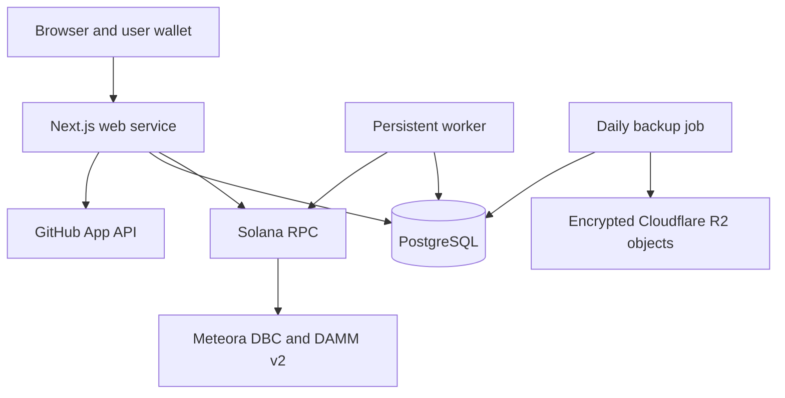

# Architecture and trust boundaries

[Documentation](README.md) / Architecture

## System overview



The production deployment uses Railway web, worker, PostgreSQL, and a separate backup service. Cloudflare provides the public domain configuration and R2 backup storage. Helius supplies the Solana RPC connection. No custom repo.ing Solana program is required for the implemented fee-routing path.

| Component | Responsibility | Main code |
| --- | --- | --- |
| Web | Pages, quotes, wallet signing handoff, GitHub sessions, payout authorization | `app/`, `app/lib/` |
| Launch coordinator | Immutable repository identity, one canonical market, durable launch state | `src/launch-coordinator.mjs`, `src/meteora-launch.mjs` |
| Worker | Finalized launch evidence, external fee indexing, durable cursors, signed payout recovery | `scripts/run-worker.mjs` |
| Accounting | Verified DBC events, DAMM fee checkpoints, settled payouts, reconciliation | `src/fee-accrual.mjs`, `src/graduated-fees.mjs`, `src/reconcile.mjs` |
| Database | Workflow state, canonical mappings, evidence, payout intents | `src/db/schema.mjs`, `drizzle/` |
| Backup | Encrypted logical dump and private R2 upload | `backup/` |

Web currently runs as one persistent instance because launch and trade signing sessions have in-memory state. Horizontal scaling or replacing it with stateless functions requires changes to that session design. The worker is a separate persistent process; it does not run as a browser request.

## Sources of truth

- **GitHub:** immutable repository identity and the authenticated user's current effective admin permission.
- **Solana and Meteora:** canonical pool state, finalized swaps, earned fees, migration state, and actual settlement.
- **PostgreSQL:** workflow records and balances derived from verified evidence, plus the history required to recover pending and settled payouts.

Names and GitHub paths can change. The immutable numeric repository ID remains the canonical application key. A market's mint and pool must resolve against an approved config; a URL or a user-supplied account address is insufficient proof.

## Launch and trade flow

```text
Resolve public repository → find existing market → reserve canonical launch
→ prepare and review → wallet signs → submit → finalized evidence → index
```

The coordinator and database uniqueness rules prevent duplicate canonical launches. An ambiguous submission stays unresolved until its chain evidence can be checked. The optional first buy executes with the launch, and the server enforces its 3% supply cap.

Trades use server-prepared Meteora quotes and wallet-signed transactions. UI result cards distinguish pending from proven success or failure. The worker also finds canonical external DBC swaps, so accounting does not depend solely on transactions initiated through the site.

The current `DBC_CONFIG` selects future launches. `DBC_LEGACY_CONFIGS` retains previously approved configurations. Resolution derives each market's canonical pool from its mint and an approved config; changing launch selection does not reprice existing markets.

## Authorities and trust

| Authority | What it controls |
| --- | --- |
| User wallet | User-signed launches, trades, discovery claims, and wallet-binding messages |
| Current GitHub admin | Eligibility to bind or change the repository payout recipient and request builder claims |
| Protected creator signer | On-chain creator fee claims and the creator's migrated LP position |
| Protected partner signer | Partner fee claims, including authorized discovery payouts |

GitHub authorization is enforced by the application. Meteora verifies its on-chain signing authorities; it does not independently check GitHub identity. Builder and discovery payouts therefore depend on the platform's signer custody and authorization logic. The 50/50 migrated liquidity principal is permanently locked on chain, while position fees remain claimable.

The configured GitHub App requests Metadata read only. Its short-lived user credential is encrypted in a Secure, HttpOnly production cookie with a maximum one-hour session. Wallet binding requires a domain-separated, expiring message and a one-time nonce. The session and historical verification record do not replace a fresh GitHub authority check before sensitive actions.

Creator and partner secrets belong only on the web service. The worker recovers already-authorized signed transactions and requires neither private key. RPC credentials, GitHub secrets, and signing keys must stay out of browser bundles and `NEXT_PUBLIC_` variables.

## Fees, claims, and recovery

Money is stored in integer base units. DBC credits come from canonical finalized fee events with stable deduplication keys. DAMM credits come from increases in the validated creator position's cumulative SOL entitlement. The `builder_fee_credits` view combines both paths for lifetime builder earnings.

Builder payouts check current authority, saved recipient, reconciliation, and an expiring signed review. A per-repository lock and durable intent coordinate submission. Before broadcasting, the application saves the signed transaction and its signature. Settlement verifies the exact transaction and recipient evidence, separating fees from rent refunds.

The worker can reconcile a lost response or rebroadcast the identical authorized transaction. Unresolved evidence blocks another payout. It must not create a second payment merely because the first request timed out.

Discovery has separate credits and claims, funded by partner fees. Its immutable rules are recorded per enrolled market. The operator must retain the partner fees backing earned unpaid rewards; the reward split is an application-managed obligation, not a separate on-chain escrow.

Reconciliation compares indexed entitlement, settled withdrawals, and current on-chain fees. Contradictions produce an error or review state. It does not alter credits to conceal a shortfall.

## Display data and scope

Repository metadata and market displays use cached or streamed reads for responsiveness. Authorization, signing, and payout decisions use their own current checks. USD values are estimates; SOL base units remain the accounting denomination.

After graduation, builder fee tracking and claims cover the verified DAMM creator position. DAMM trade evidence and SOL volume are indexed after canonical migration verification and used in graduation status and protocol analytics. Native DAMM execution and chart candles are not implemented; the product links to the verified Meteora destination.

## Recovery boundaries

A Git checkout restores application source and migrations. Recovering the service also needs database backups, protected signer keys, and environment configuration. Restoring fee evidence without settled payout history could permit duplicate payments, so restore and reconcile the complete claim ledger before enabling payouts. Follow [Backups](BACKUPS.md) and [Production](PRODUCTION.md).

For verification evidence, use [Graduated fees](GRADUATED_FEES.md), [Claiming](CLAIM.md), and [Discovery rewards](DISCOVERY_REWARDS.md).
