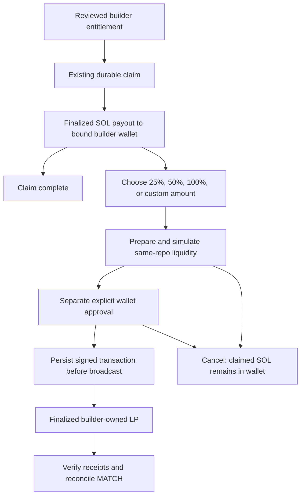

# P4: Builder Reinvest

**Preparation is authorized before P3's live proof. Production execution stays disabled until a bounded P3 mainnet deployment is independently verified and reconciles `MATCH`.** This supersedes the earlier plan to wait before implementing P4. No production migration or deployment is part of this preparation.

## The two choices

```text
Builder earnings: X SOL
[ Claim ] [ Reinvest ]
```

Claim uses the existing reviewed payout unchanged. Reinvest uses that same claim first, shows its settled receipt, and then offers **25%, 50%, 100%, or a custom amount** from that payout. A compact second review shows investment, account/network costs, the same repository pool, and builder ownership. Only **Approve in wallet** requests the separate liquidity signature.

There is no direct platform-to-builder LP transfer, automated reinvestment, recurring consent, strategy picker, cross-pool routing, or batch reinvestment. P3's partner signer and allocation reserve do not participate. The server signs only the newly generated position NFT account; the builder signs as funder, fee payer, and LP owner.

## State model



The claim remains in `repo_claims`; reinvestment never replaces or reverses it. A reinvest intent moves through `prepared → submitted → settled`. `prepared → cancelling → aborted` stops an unsigned offer. Submitted failures may become `aborted` only with authoritative failure/expiry evidence. Unknown evidence remains reserved for review.

A partial transaction already delivered to a wallet can be signed or independently broadcast until its blockhash expires. Cancellation therefore retains its reservation until both RPCs prove expiry and absence. Recovery also looks for the exact issued message at its unique position address, so an independently broadcast transaction cannot free credit and then be attributed twice. Cancellation does not send a transaction or remove SOL from the wallet.

## Identity and funding boundaries

- The immutable repository ID determines the canonical launch, approved DBC config, verified graduation, DAMM pool, and token/SOL mints. Caller-supplied pools, mints, receivers, or LP owners are rejected.
- Current GitHub admin authority is rechecked; the authenticated GitHub identity, bound payout wallet and binding timestamp are pinned. The connected wallet must match. Authority/binding is checked again immediately before submission.
- A settled claim for this repository and wallet is mandatory. The durable claim message, finalized receipt, actual wallet credit, and fee amounts are verified through **two RPCs**. Rent refunds do not increase the eligible budget.
- The amount is capped by the claim's fee payout minus prior verified economic reinvestment and all unresolved reservations. Unrelated wallet holdings cannot enlarge this cap. Actual wallet funds must also cover the transaction; SOL is fungible, not segregated in an escrow.
- The builder's wallet owns the newly derived position NFT, with one token and no delegate. The position is withdrawable. This release adds no withdrawal UI or LP strategy management.

## Durable intent

Migration `0015_builder_reinvest` adds only `builder_reinvest_intents` and its constraints/indexes. It records:

| Area | Bound evidence |
| --- | --- |
| Source | Claim ID/signature, fee payout amount, repo ID, wallet, GitHub ID and binding time |
| Destination | Mainnet/local rehearsal network, canonical pool, token/SOL mints, builder LP owner and new position/NFT |
| Review | Integer economic budget, exact swap input, minimum output, token deposit maxima, minimum/expected LP liquidity, rules, cost cap, expiry |
| Approval | SHA-256 terms hash, exact prepared message hash, NFT-only signed offer; then the complete wallet-signed transaction and signature before broadcast |
| Settlement | Finalized slot, position, exact token/SOL/LP deltas, economic debit, wallet debit, separate account/network cost and network fee |

Unique idempotency keys, signatures and positions plus one unresolved intent per claim prevent duplicates. Repository advisory locks serialize funding reservations and execution with claims and wallet-binding changes. A timeout must retrieve the same intent rather than create a replacement.

The SDK path performs an atomic SOL-to-repo-token balancing swap and adds both assets to the same pool. The purchased tokens bound the deposit; existing builder token holdings are not swept. Unused SOL and remaining purchased tokens stay in the builder wallet.

## Simulation and verification

Fixed V1 controls are 1% maximum slippage, 0.5% maximum swap spot-price impact, and 0.012 SOL maximum additional account/network cost. These are application bounds, not advanced user settings. The economic amount is chosen by the builder and capped by their remaining verified payout.

Preparation simulates the exact partial transaction without a builder signature or broadcast. After explicit wallet signing, the server rejects any message/signature changes, rechecks authority, binding, graduation, remaining credit, price impact, fresh quote bounds and expiry, then simulates again with signature verification. Neither simulation grants spending authority.

Settlement reuses the read-only P3 receipt verifier. Both RPCs must agree on the finalized transaction and independently validate exact message, one swap and deposit, pool and wallet token deltas, native plus wrapped-SOL wallet debit, new LP liquidity and NFT authority. Canonical pool snapshots and simulation cost evidence also require agreement; transient disagreement stops preparation/submission instead of falling back to one provider.

## Failure-state matrix

| Condition | Required behavior |
| --- | --- |
| Disabled gate or missing P3 proof | No new preparation/submission; ordinary Claim continues |
| Not graduated / unsupported assets | Reinvest unavailable; fees remain normally claimable |
| Wrong repo, pool, mint, builder wallet or changed binding | Reject before broadcast |
| Claim pending, missing, wrong-wallet or unproven | No reinvestment budget |
| Amount exceeds remaining claim / insufficient wallet funds | Reject; no overdraft or extra claim |
| Quote drift, excessive slippage/impact, failed simulation | Reject the signed submission; cancel/expire before a fresh review |
| Expired intent or blockhash | No new submission; preserve reservation until absence is proven |
| Duplicate key, replay, concurrent submission | One durable intent and one economic action |
| Wallet rejected after claim | Claim stays settled; SOL stays in builder wallet; offer cancelled |
| Page refresh or lost response | Read persisted intent/claim; do not repeat payout |
| Submitted/uncertain transaction | Keep reservation; exact signed-byte recovery only |
| Wallet broadcasts independently | Recover only the exact issued message and its builder signature |
| LP owner, receipt, token or wallet delta mismatch | Keep unresolved for review; never report success or edit balances to match |
| RPC disagreement or missing evidence | Fail closed; never infer absence or success from one RPC |
| Finalized failed liquidity transaction | Payout remains settled; economic budget releases, but a network fee may have been spent |

## Reconciliation

`reconcileBuilderReinvest` re-verifies source claim receipts and finalized LP receipts through both RPCs, compares persisted settlement fields, and checks per-claim reserved plus spent amounts. The repository fee reconciler remains separate and must also return `MATCH` after the worker refreshes DAMM fee checkpoints. A submitted unresolved intent prevents a completed proof.

Lifetime **earned** and **paid** are unchanged by reinvestment. `reinvested` describes a disposition of paid fees and is never added to earnings again. Account/network costs are separate. Deposits are not trading volume; only the real balancing swap is a trade. Additional builder LP fees are outside the original repo-fee ledger in V1.

Recovery requires the configured verification RPC and no builder/platform private key. It handles existing offers and previously signed transactions only; it never chooses an amount or pool, prepares a new intent, requests a new signature, or schedules another investment.

## Production gate and rollout

Keep these settings disabled/unset during preparation:

```text
BUILDER_REINVEST_ENABLED=false
BUILDER_REINVEST_VERIFICATION_RPC_URL=
BUILDER_REINVEST_P3_SIGNATURE=
BUILDER_REINVEST_LOCAL_REHEARSAL=false
```

Before a later approved activation, migrate web/worker together, provide an independent verification RPC on both services, and pin the exact successful P3 mainnet signature. Even with the enable flag set, P4 checks that P3 is a non-zero settled mainnet LP, within 0.05 SOL investment and 0.012 SOL overhead, with matching finalized receipt/position/costs and repository, revenue and liquidity reconciliations. Empty/local `MATCH` evidence cannot unlock it.

Local rehearsal bypasses only that **mainnet P3 prerequisite**: both endpoints must be loopback, agree on a non-mainnet genesis, `NODE_ENV` cannot be production, and `BUILDER_REINVEST_LOCAL_REHEARSAL=true` is explicit. All claim, wallet, budget, pool, simulation and settlement checks still run.

Turning the gate off stops new preparation/submission. Keep verification RPC and recovery configured for pending intents; a gate cannot revoke transactions already issued to a wallet. Existing receipts remain readable. After P3's first live `MATCH`, review P4's local evidence and perform one explicit builder-wallet mainnet rehearsal before broader release.

## References and evidence

Implementation follows the pinned `@meteora-ag/cp-amm-sdk@1.4.10` interfaces, [Meteora's DAMM SDK](https://github.com/MeteoraAg/damm-v2-sdk) and [Solana transaction simulation](https://solana.com/docs/rpc/http/simulatetransaction). Verification results and remaining limits are recorded in [P4 preparation evidence](BUILDER_REINVEST_VERIFICATION.md).
