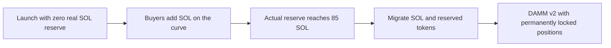

# Liquidity and graduation

[Documentation](README.md) / Liquidity

**Selected profile:** 85 SOL graduation with the 1% builder reservation, activated for new mainnet launches on September 26, 2026. This extends the balanced 85 SOL profile introduced September 25. Existing markets keep their original configurations.

## What we chose

repo.ing uses Meteora's Dynamic Bonding Curve (DBC) for early trading, then migrates a completed market into Meteora DAMM v2. DBC prices trades using a configured curve; actual purchases build the reserve used for graduation. This is Meteora's supported launch lifecycle. [Meteora DBC overview](https://docs.meteora.ag/core-products/dbc/what-is-dbc).

The new profile balances two goals: smaller price moves for early trades and a graduation target that requires less demand than the deeper 170 or 340 SOL alternatives we tested.

## Why change the original curve?

The original curve was very sensitive to early buying. A fresh-pool 1 SOL purchase had approximately 93.62% price impact. The September 25 balanced curve reduced that to approximately 3.47%. The current builders profile reserves another 1% of supply; its exact quotes differ, as described below.

| Buy size | Original curve | September 25 balanced curve |
| --- | ---: | ---: |
| 0.1 SOL | 6.28% impact | 0.35% impact |
| 1 SOL | 93.62% impact | 3.47% impact |
| 5 SOL | 486.15% impact | 17.34% impact |

These are installed-SDK integer quotes for otherwise empty pools. Impact compares average execution price with starting spot price, excluding the 1.75% trading fee. These are reproducible comparisons, not current quotes for an existing market. Other trades change the reserve and execution price.

Reproduce the comparison without network access or signing:

```sh
node scripts/compare-launch-curves.mjs
```

The 170 and 340 SOL profiles reduce impact further, but require proportionally more reserve to graduate. The selected profile improves early 0.1–1 SOL trading; a fresh 5 SOL buy still moves the price substantially. Review each executable quote.

## Where the liquidity comes from



The September 25 balanced curve begins with approximately **28.33 virtual SOL** for pricing. Every profile begins with **zero real SOL reserve**. Virtual amounts are curve parameters. They cannot be withdrawn or used as an external cash reserve.

Buys add SOL to the reserve after trading fees. Sells remove SOL and can move graduation progress backward. **85 SOL is the quote-reserve threshold**, not total volume: repeated buying and selling can produce substantial volume while leaving a small reserve. With no sells, approximately 86.514 SOL of fee-inclusive buy input would build 85 SOL of reserve, excluding setup and network costs.

The September 25 balanced configuration's roughly 26.56 SOL starting fully diluted valuation is a spot-price calculation across total supply. It does not measure deposited liquidity or the proceeds available from selling that supply.

## Launch allocation

| Setting | Selected value |
| --- | --- |
| Token supply | 1 billion tokens |
| Decimals | 6 |
| Quote asset | SOL |
| Supply reserved for migration | Approximately 20%, subject to SDK rounding |
| Configured leftover allocation | 10,001,000 tokens plus SDK rounding residue; includes the one-time 10 million builder grant |
| Builder grant | 1% of supply, claimable after verified graduation for enrolled markets |
| Initial buy | Optional; defaults to No buy |
| First-buy cap | 3% of total supply, with 1%, 2%, and Max 3% presets |
| Fresh-pool Max 3% buy | 0.856011397 SOL on the current builders profile, including the DBC trading fee; launch deposits and network costs are additional |

The current builders profile returns roughly 2.4% fewer tokens than the September 25 balanced profile for the recorded 0.1/1/5 SOL fixture buys. Its reserved inventory changes the quotes, not the 85 SOL target or trading fee. [Exact rehearsal and activation evidence](BUILDER_ALLOCATION_PLAN.md#gate-1-rehearsal-record--2026-09-26).

The cap applies to the atomic launch purchase through repo.ing. Subsequent ordinary purchases can exceed 3%; this is not a lifetime wallet limit or a guarantee against concentrated ownership. The launch review shows simulated costs before signing.

## What the LP locks mean

At graduation, the configured allocation splits migrated liquidity into two positions:

- **50% creator position**, used for repository builder fee earnings.
- **50% partner position**, used for repo.ing's partner economics.

Both portions are **permanently locked**, with zero immediately withdrawable liquidity. The lock applies to liquidity principal. Trading fees remain claimable. DAMM v2 represents positions with NFTs and tracks locks and earnings on their position accounts. [Meteora DAMM v2 overview](https://docs.meteora.ag/core-products/damm-v2/what-is-damm-v2).

The protected repo.ing creator signer controls the creator position and routes builder payouts after current GitHub authority and wallet checks. Verifying a repository does not transfer its position NFT to the user's wallet. Builder entitlement and payout enforcement are application-managed; the liquidity lock is enforced on chain. See [architecture](ARCHITECTURE.md#authorities-and-trust).

Meteora provides a migrator service and a manual migration fallback. Threshold completion and successful migration are separate states. repo.ing shows a transition state until it verifies the destination pool, then trades that pool on-site (DAMM v2 `swap2`, ExactIn, 1% minimum out) with a **View pool on Meteora** link. [Official migration flow](https://github.com/MeteoraAg/dynamic-bonding-curve-sdk/blob/main/packages/dynamic-bonding-curve/README.md#flow).

## Fees and rewards

### Before graduation: DBC

The fixed 1.75% total trading fee has nominal shares of **0.994% builders**, **0.406% repo.ing partner**, and **0.350% Meteora protocol**. Meteora receives 20% of the total fee; 71% of the remaining trading fee goes to the creator. Settlement uses exact integer amounts and per-trade rounding. [Fee proof](FEE_CONFIG.md).

For enrolled markets, the launcher earns **50% of actual eligible partner fees**, approximately 0.203% of fee-paying trade value under this configuration. Accrual ends at the first of curve completion, 30 days, or the recorded lifetime cap (2.5 SOL for new v2 launches; 1 SOL for v1). The completing DBC swap is included. Builder fees and the total trader fee stay unchanged. Accrued rewards remain claimable afterward. [Discovery rules](DISCOVERY_REWARDS.md).

### After graduation: DAMM v2

The selected migration config has a **1% base fee, dynamic fees enabled, 20% protocol share, and SOL-only fee collection**. The total fee can vary. The creator earns the fees attributable to its locked position; the pre-graduation 0.994% builder rate does not carry over as a fixed post-graduation rate.

Remaining DBC builder fees and newly earned DAMM builder fees are included in repo.ing's lifetime accounting. A combined claim can pay both. The DAMM instruction claims all accrued position fees, so its review explains that fees earned before confirmation can be included. Discovery rewards do not accrue from DAMM trades. [Graduated-fee accounting and payout evidence](GRADUATED_FEES.md).

## Existing markets and verification

The original configuration graduates at **29.954748784 SOL**. Selecting the new config only affects future launches; existing canonical mints and pools keep their original curves. All three approved configurations remain recognized by web and worker. No treasury liquidity deposit or market buy was part of this change.

| Profile | Graduation threshold | Config |
| --- | ---: | --- |
| Current builders profile | 85 SOL | `2YbBp7HDQXUA3bk75yxx1kefcVfYYn3oYBNyJGmvre1M` |
| Earlier balanced profile | 85 SOL | `261xpZVAz5k3ZfwfxXdgkgLowiH6NUzFEHtihhD4YMq1` |
| Original profile | 29.954748784 SOL | `D7oz8xQ4seaNaEgiDS4fu3YJfmUvR5iPuznxuqKV4u1c` |

 The [activation record](LIQUIDITY_REVIEW.md) includes the finalized creation receipt, comparisons, local migration tests, and deployment checks.

As of the recorded rollout, local tests cover actual migration, locked positions, trading, builder payout, and recovery after a lost broadcast response. **The first mainnet graduation and graduated payout remain unobserved.** Verified DAMM trades and SOL volume are now indexed for graduation status and protocol analytics. Native DAMM trade execution and chart candles are not implemented; graduated trading uses the verified Meteora link.

Additional P3 protocol liquidity and P4 builder reinvestment remain disabled. Those later positions have separate ownership rules; the permanent locks described above apply specifically to the migrated creator/partner positions. [Activation boundaries](REPO_TOKEN.md#liquidity-and-reinvestment-gates).
