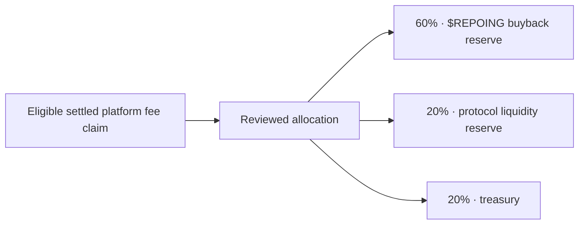

# $REPOING and platform revenue

[Documentation](README.md) / $REPOING

**Status checked September 27, 2026:** the canonical market has launched and its mint is verified. The revenue policy is active. Buyback execution is off, and `REPO_TOKEN_MINT` remains unconfigured in the inspected production release.

**Update, September 30, 2026:** the in-app buyback executor (`REPO_BUYBACK_*`), the P3 liquidity executor (`REPO_LIQUIDITY_*`), and P4 Builder Reinvest are still not enabled. The team now carries out the V1 policy manually from published wallets:

- `scripts/platform-sweep.mjs`, run on the web service, claims platform fees to the partner fee wallet `H7TKxmpTzCrujJQETuCTL5sjCgaZ8g4yW94ZEQPC7RY3`, allocates 60/20/20, and moves only the buyback share still owed to the custody buyback wallet `FgzeYRRJLwd3aZQFBgn3a5KnN4mZixSRB9keYzoBm5Jy`. The liquidity and treasury shares stay in the partner wallet. Since October 2, 2026 it reads markets one at a time and retries an RPC rate limit (HTTP 429) or other transient error with backoff, honouring Retry-After (retries pause while the RPC stays limited read after read); a market still unreadable after its retries is reported with the retries spent and is claimed on a later run.
- Buybacks are swapped manually from the buyback wallet (platform revenue) and from the team wallet `4euCWuZo1Ud3PfhFQr9ShmJVzqmARGqY2LR23YECDYce` (team buybacks on top of the policy). The worker detects finalized $REPOING buys from these wallets and the partner fee wallet and publishes them as receipts.
- Liquidity is added manually by the team wallet to the canonical $REPOING DAMM v2 pool `FHw49kTEEjzBhRuMff9F1Xw1bLcBpwvsaSboaAWpAcaT`. These positions are not permanently locked yet.

[Stats](https://repo.ing/stats) lists every buyback and liquidity deposit with its on-chain receipt, the running buyback total, and where buybacks stand against the policy (SOL ahead or due).

The canonical repository market is live with ticker **REPOING**. Earlier planning used `$REPO`. See the [verified identity, transaction, and initial-purchase disclosure](REPO_IDENTITY.md). At the launch checkpoint, buyback execution was disabled and the production executor mint setting was unconfigured; the in-app executor remains off, and buybacks are now made manually as described above.

**Accepted design:** [$REPOING as the ordinary market for the repo.ing repository](REPO_SELF_LAUNCH_REVIEW.md), inheriting the current 1 billion supply, 1% builder allocation and normal discovery/fee rules. Finalized addresses and the launch receipt are recorded in [Official identity](REPO_IDENTITY.md). Publishing the mint does not enable spending. The revenue policy below is unchanged.

## Repository-market identity and protocol designation

| | Repository markets | $REPOING |
| --- | --- | --- |
| Purpose | A canonical market associated with a public GitHub repository | Accepted design: the ordinary market for `New1Direction/repo.ing`, also designated as the protocol token |
| Identity | GitHub repository ID, canonical mint, and pool | [Verified mint published](REPO_IDENTITY.md); runtime executor configuration remains pending |
| Supply | Current launch profile: 1 billion tokens, six decimals | Verified fixed supply: 1 billion tokens, six decimals |
| Builder allocation | 1% for new enrolled repository markets, after verified graduation | Applies normally after verified graduation; operator-related for the self repository |

A ticker does not establish the official $REPOING identity. Verify the actual finalized canonical market before publishing/configuring its mint. This document gives no token equity, redemption, governance, staking, or revenue-distribution rights.

## Active V1 policy: 60 / 20 / 20

The immutable active policy is **600 / 200 / 200 permilles**. Allocations use integer lamports, with rounding remainder retained in treasury. Each settled claim can be allocated once.

**Allocatable funds are settled platform-fee claims.** The DBC collector first reserves every unpaid discovery entitlement, then sends only the platform remainder to the receiving treasury. DAMM claims retain their existing partner-position path. Unclaimed accrual is never spendable. Builder fees are excluded. [Collection, custody and execution gates](DBC_PLATFORM_COLLECTION.md).

As an ordinary canonical market, $REPOING’s own eligible partner-fee claims are included too: the allocator has no self-market exclusion. Its builder earnings remain outside this policy even when their recipient also operates repo.ing.

A reserve records an allocation. It does not mean a trade has executed, tokens have been purchased, or tokens have been burned.

## Buyback activation boundary

Already implemented:

- platform revenue accounting and reconciliation;
- immutable policy versions and claim-linked allocations;
- bounded, expiring intents, operator review, and idempotency checks;
- a disabled execution gate with required mint, destination, venue, and size/slippage settings.

Still required before in-app, protocol-executed buybacks (manual buybacks from the published wallets do not use this path):

1. Bind the [verified canonical mint and launch details](REPO_IDENTITY.md) into the reviewed runtime buyback configuration. Mint verification is complete; executor configuration remains pending.
2. Implement and review the trading route; the present executor deliberately rejects execution because no approved venue implementation exists.
3. Bind the real quote, expected output, minimum received, destination account, spending limits, and expiry to the reviewed intent.
4. Prove durable submission, recovery, exact settlement, and replay protection in local tests.
5. Configure and explicitly activate a bounded production attempt only when eligible claimed revenue is available.
6. Verify the receipt and reconcile non-zero spend to `MATCH`.

Setting an environment flag alone cannot complete those steps. **No burn mechanism is implemented or activated.** Purchased-token custody and any later burn policy require a separate explicit decision; this release makes neither a burn promise nor a purchase schedule.

## Liquidity and reinvestment gates

- **P3:** first deployment must be manually reviewed and executed, with at most **0.05 SOL investment + 0.012 SOL account/network overhead**. A verified graduated pool, settled allocated platform revenue, simulation, exact wallet/token/LP deltas, and final `MATCH` are required. There is no automatic market selection or spending.
- **P4:** builder reinvestment stays disabled until P3 completes one verified non-zero mainnet deployment. The builder must receive claimed SOL in their wallet first, then separately approve a same-repository pool investment. Cancellation leaves the claimed SOL in the wallet; the resulting LP position belongs to the builder.

The original 50/50 migrated positions are permanently locked. Later P3 positions are platform-controlled and are not permanently locked; later P4 positions belong to the builder. These positions must not be described as having identical custody or lock terms.

## Public transparency

[Protocol analytics](https://repo.ing/stats) reports verified indexed activity, settled builder payouts, and reconciled revenue reserves. Its public buyback section lists every published buyback with its on-chain receipt, a running SOL total, and the standing against the buyback policy; its liquidity section lists manual deposits into the $REPOING pool; and its token-locks section lists every $REPOING Jupiter Lock escrow. The launch purchase is excluded. [First buyback audit](BUYBACK_AUDIT_2026_09_28.md). USD figures are current-price estimates; accounting remains in SOL lamports.

For exact implementation and operator steps, read [platform revenue](PLATFORM_REVENUE.md), [active policy](REVENUE_POLICY_V1.md), [first P3 deployment](P3_FIRST_LIVE_RUNBOOK.md), and [P4 preparation](BUILDER_REINVEST_PLAN.md).
